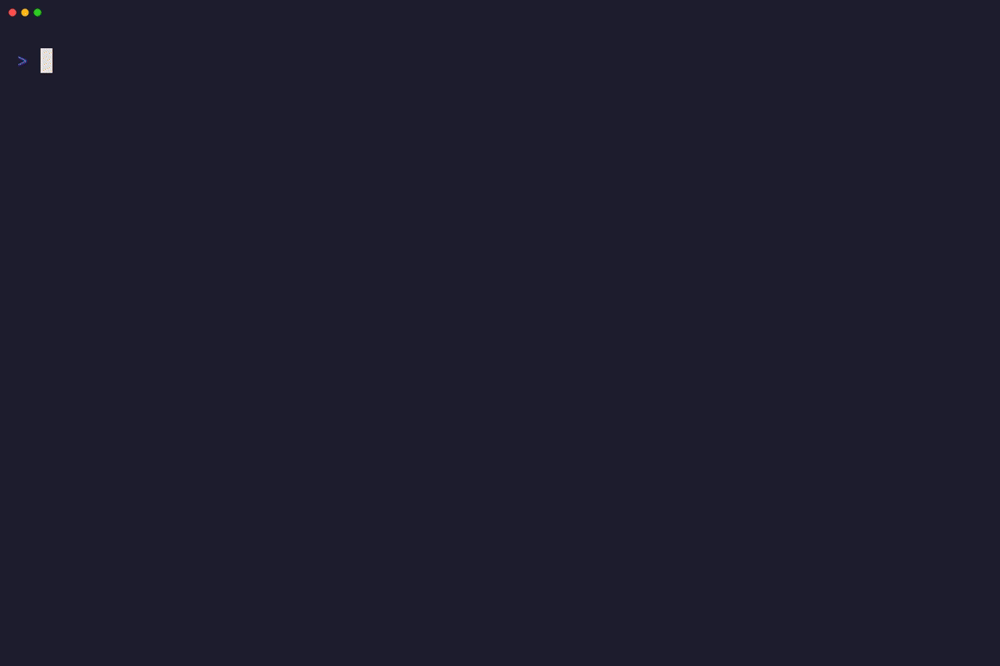

# Klotski Puzzle

A terminal-based sliding block puzzle game written in Go using [Bubble Tea](https://github.com/charmbracelet/bubbletea).

## Game Overview

Klotski is a classic sliding block puzzle played on a **4-wide by 5-tall** grid.
The objective is to move the large 2x2 block to the bottom-center of the board
by sliding pieces horizontally or vertically. There are only **two empty cells**
on the board at any time, so space is tight and every move counts.

Empty target cells display a dim `L` to indicate where the large block must go.

## Demo



The demo shows cursor navigation, piece selection and movement, undo, cheat mode
(optimal next move hint), difficulty switching, and coordinate labels.

To regenerate the GIF with [VHS](https://github.com/charmbracelet/vhs):

```bash
go build -o puzzle .
vhs demo.tape
```

## Pieces

| Piece Type | Size       | Count | Symbol |
|------------|------------|-------|--------|
| Small      | 1x1        | 4     | `s`    |
| Medium     | 1x2 / 2x1 | 5     | `m`    |
| Large      | 2x2        | 1     | `L`    |

**Total occupied cells:** 4(1) + 5(2) + 1(4) = **18 out of 20 cells**

This leaves exactly **2 empty cells** for maneuvering.

## Rules

1. Pieces can only be moved **horizontally or vertically** (no diagonal moves).
2. A piece can only move into **empty space** — pieces cannot overlap.
3. A piece moves **one cell at a time** in the chosen direction.
4. The game is won when the **large 2x2 block** occupies the bottom-center
   position: columns 1-2, rows 3-4 (0-indexed).

## Game Modes

### Free Play

The default mode. Random puzzles are generated at a chosen difficulty level.
Press `n` for a new puzzle or `1`/`2`/`3` to switch difficulty.

### League Mode

A structured progression through **620 pre-generated puzzles** sorted by
increasing difficulty (1-179 optimal moves). Press `g` from free play to enter.

- **Scoring:** 10 points for an optimal solution, scaling proportionally down
  to a minimum of 1 point for any solve.
- **All unlocked:** Every puzzle is accessible from the start. Replay any
  scored puzzle to improve your score.
- **Nickname:** Enter a nickname on first entry. Press `@` to switch players.
- **Leaderboard:** Press `Tab` in the league browser to see all players ranked
  by total score.
- **Persistence:** Scores are saved to `~/.klotski-puzzle/save.json` and the
  last player is remembered across sessions.
- **No cheats:** Cheat mode is disabled during league play.

### Board Editor

Create custom puzzles from scratch. Press `e` from free play to enter.

- Place pieces on an empty 4x5 grid: Large (2x2), Vertical (1x2),
  Horizontal (2x1), Small (1x1).
- Cycle piece types with `Tab`, place with `Enter`/`Space`.
- Remove pieces with `x`/`Backspace`/`Delete`. Clear the board with `r`.
- Ghost preview shows a dim outline before placing.
- Press `p` to validate and play: checks for exactly 1 Large piece, at least
  2 empty cells, and runs BFS to confirm solvability.
- Custom boards play with a "Custom" badge and computed optimal move count.

## Controls

### Free Play

| Key            | Action                           |
|----------------|----------------------------------|
| Arrows / hjkl  | Move cursor / move selected piece|
| Enter / Space  | Select / deselect piece          |
| Escape         | Deselect piece                   |
| `n`            | New game (same difficulty)       |
| `1` / `2` / `3` | New game — Easy / Medium / Hard |
| `u`            | Undo last move                   |
| `U`            | Restart (reset to initial state) |
| `e`            | Open board editor                |
| `g`            | Enter league mode                |
| `c`            | Toggle coordinate labels         |
| `?`            | Toggle cheat mode                |
| `q` / Ctrl+C   | Quit                            |

### League Browser

| Key            | Action                           |
|----------------|----------------------------------|
| Arrows / jk    | Browse puzzles                   |
| Ctrl+u / Ctrl+d | Page up / page down (15 items) |
| `g` / `G`      | Jump to first / last puzzle      |
| Enter / Space  | Play selected puzzle             |
| Tab            | Show leaderboard                 |
| `@`            | Switch player                    |
| Escape         | Return to free play              |
| `q` / Ctrl+C   | Quit                            |

### League Play

| Key            | Action                           |
|----------------|----------------------------------|
| Arrows / hjkl  | Move cursor / move selected piece|
| Enter / Space  | Select / deselect piece          |
| Escape         | Deselect, or return to browser   |
| `u`            | Undo last move                   |
| `U`            | Restart puzzle                   |
| `c`            | Toggle coordinate labels         |
| `q` / Ctrl+C   | Quit                            |

After winning: `Enter` advances to the next puzzle, `Esc` returns to the browser,
`u`/`U` to undo/restart and retry for a better score.

### Board Editor

| Key            | Action                           |
|----------------|----------------------------------|
| Arrows / hjkl  | Move cursor                      |
| Tab            | Cycle piece type                 |
| Enter / Space  | Place piece                      |
| x / Backspace  | Remove piece at cursor           |
| `r`            | Clear board                      |
| `c`            | Toggle coordinate labels         |
| `p`            | Validate and play                |
| Escape         | Cancel (return to free play)     |
| `q` / Ctrl+C   | Quit                            |

## Cheat Mode

Toggle with `?` in free play to see the optimal next move. The hinted piece is
highlighted with a purple background and a direction arrow. Hints are
recomputed automatically after each move. Cheat mode is disabled in league play.

## Difficulty

Each generated puzzle is solved by the engine using BFS to determine the
minimum number of moves required:

| Level  | Optimal Moves | Description                           |
|--------|---------------|---------------------------------------|
| Easy   | 1 – 39        | Good for learning the mechanics       |
| Medium | 40 – 79       | Requires planning several moves ahead |
| Hard   | 80+           | Challenging; may need 100+ moves      |

The difficulty badge and optimal move count are displayed next to the title.

## Board Layout

```
  0   1   2   3      <- columns
+---+---+---+---+
|   |   |   |   |  0  <- rows
+---+---+---+---+
|   |   |   |   |  1
+---+---+---+---+
|   |   |   |   |  2
+---+---+---+---+
|   |   |   |   |  3
+---+---+---+---+
|   |   |   |   |  4
+---+---+---+---+
```

### Win Position

The large 2x2 block must reach the bottom-center:

```
+---+---+---+---+
|   |   |   |   |
+---+---+---+---+
|   |   |   |   |
+---+---+---+---+
|   |   |   |   |
+---+---+---+---+
|   | L | L |   |
+---+---+---+---+
|   | L | L |   |
+---+---+---+---+
```

## Building and Running

```bash
go build -o puzzle .
./puzzle
```

Or run directly:

```bash
go run .
```

## Generating Presets

The 620 league puzzles are pre-generated and committed as `presets.go`.
To regenerate:

```bash
GENERATE_PRESETS=1 go test -run TestGeneratePresets -timeout 30m -count=1
```

This generates boards across all difficulty levels, deduplicates by canonical
state, and selects an evenly-spaced set sorted by optimal move count.

## How to Play

1. Launch the game. A randomized starting layout is generated.
2. Use the arrow keys (or `h/j/k/l`) to move the cursor over the board.
3. Press **Enter** or **Space** to select the piece under the cursor.
4. Use the arrow keys (or `h/j/k/l`) to slide the selected piece.
5. Press **Escape** to deselect.
6. Slide the large block to the bottom-center to win.
